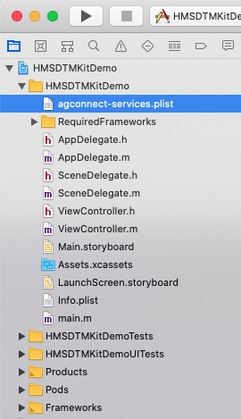
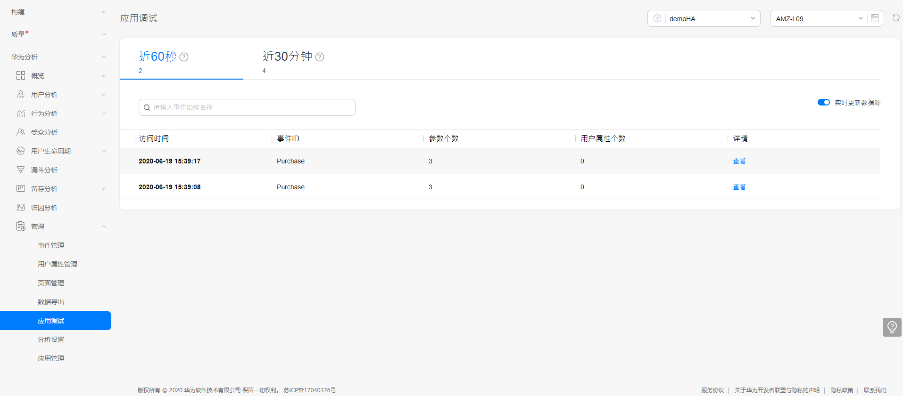

# HMS Dynamic Tag Manager(DTM) Sample for iOS

 

English | [中文](https://github.com/HMS-Core/hms-dtm-demo-ios/blob/master/README_ZH.md)

## Table of Contents

 * [Introduction](#introduction)
 * [Getting Started](#getting-started)
 * [Supported Environments](#supported-environments)
 * [Result](#result)
 * [License](#license)

## Introduction
With Dynamic Tag Manager, you can dynamically update tracking tags on a web-based UI to track specific events and report data to third-party analytics platforms, tracking your marketing activity data as needed.

This demo shows you how to track purchase events and report data, helping you integrate Dynamic Tag Manager quickly. 

For more details, please refer to [Development Guide](https://developer.huawei.com/consumer/en/doc/development/HMSCore-Guides/introduction-0000001050043907).

## Getting Started
Before you start developing an app, configure your app information in AppGallery Connect.
1. Register as a developer.

Register a [HUAWEI account](https://developer.huawei.com/consumer/en/doc/20300).

2. Create an app.

Create an app by following instructions in 
[Creating an AppGallery Connect Project](https://developer.huawei.com/consumer/en/doc/development/AppGallery-connect-Guides/agc-get-started-web#h1-1594605371607)
[Adding an Web App to the Project](https://developer.huawei.com/consumer/en/doc/development/AppGallery-connect-Guides/agc-get-started-web#h1-1594605413814).

3. Integrating the HMS Core SDK.

[Integration Using CocoaPods (Recommended)](https://developer.huawei.com/consumer/en/doc/development/HMSCore-Guides-V5/ios-sdk-0000001061753701-V5#EN-US_TOPIC_0000001070586049__section18306240739).
[Manual Integration](https://developer.huawei.com/consumer/en/doc/development/HMSCore-Guides-V5/ios-sdk-0000001061753701-V5#EN-US_TOPIC_0000001070586049__section166981340417).
    
4. Build the demo.

To build this demo, please first import the demo to Android Studio (3.X or later). Then download the agconnect-services.json file of the app from AppGallery Connect, and add the file to the app directory (\app) of the demo. 

5. Configuring App Information in AppGallery Connect.

[Configuring App Information in AppGallery Connect](https://developer.huawei.com/consumer/en/doc/development/HMSCore-Guides-V5/ios-config-agc-0000001061522978-V5).

6. poerations on the Server.

[Permissions](https://developer.huawei.com/consumer/en/doc/development/HMSCore-Guides-V5/ios-permission-0000001062160610-V5).
[Creating a Configuration](https://developer.huawei.com/consumer/en/doc/development/HMSCore-Guides-V5/ios-create-configuration-0000001061539771-V5).
[Overview](https://developer.huawei.com/consumer/en/doc/development/HMSCore-Guides-V5/ios-overview-0000001062000638-V5).
[Variable Management](https://developer.huawei.com/consumer/en/doc/development/HMSCore-Guides-V5/ios-variable-management-0000001061392574-V5).
[Condition Management](https://developer.huawei.com/consumer/en/doc/development/HMSCore-Guides-V5/ios-condition-management-0000001061694917-V5).
[Tag Management](https://developer.huawei.com/consumer/en/doc/development/HMSCore-Guides-V5/ios-tag-management-0000001061312523-V5).
[Group Management](https://developer.huawei.com/consumer/en/doc/development/HMSCore-Guides-V5/ios-group-management-0000001062859372-V5).
[Version Management](https://developer.huawei.com/consumer/en/doc/development/HMSCore-Guides-V5/ios-version-management-0000001061480983-V5).
[Visual Event Management](https://developer.huawei.com/consumer/en/doc/development/HMSCore-Guides-V5/ios-visual-event-0000001061592555-V5).
[Configuration Management](https://developer.huawei.com/consumer/en/doc/development/HMSCore-Guides-V5/ios-configuration-0000001061202925-V5).

7. Client Development.

[Procedure](https://developer.huawei.com/consumer/en/doc/development/HMSCore-Guides-V5/ios-client-dev-0000001061841030-V5#EN-US_TOPIC_0000001070586051__section13806157143317).
[Debug Mode](https://developer.huawei.com/consumer/en/doc/development/HMSCore-Guides-V5/ios-client-dev-0000001061841030-V5#EN-US_TOPIC_0000001070586051__section3946202217366).

## Supported Environments
XCode 9.0 or later and iOS 8.0 or later

## Result

## Question or issues
If you want to evaluate more about HMS Core,
[r/HMSCore on Reddit](https://www.reddit.com/r/HuaweiDevelopers/) is for you to keep up with latest news about HMS Core, and to exchange insights with other developers.

If you have questions about how to use HMS samples, try the following options:
- [Stack Overflow](https://stackoverflow.com/questions/tagged/huawei-mobile-services) is the best place for any programming questions. Be sure to tag your question with 
`huawei-mobile-services`.
- [Huawei Developer Forum](https://forums.developer.huawei.com/forumPortal/en/home?fid=0101187876626530001) HMS Core Module is great for general questions, or seeking recommendations and opinions.

If you run into a bug in our samples, please submit an [issue](https://github.com/HMS-Core/hms-dtm-demo-android-studio/issues) to the Repository. Even better you can submit a [Pull Request](https://github.com/HMS-Core/hms-dtm-demo-android-studio/pulls) with a fix.

## License
The sample code has obtained the [Apache License, version 2.0](http://www.apache.org/licenses/LICENSE-2.0).

